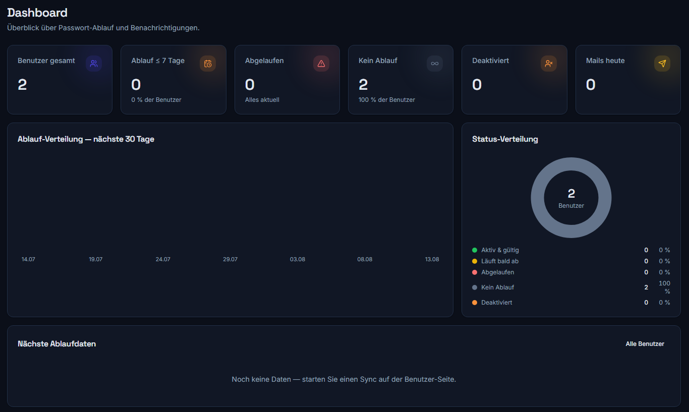
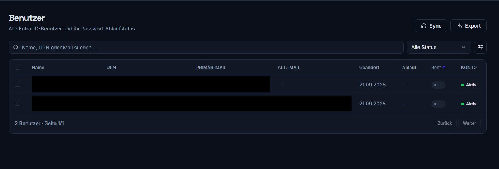

<div align="center">
  
  
  <p><strong>Password Expiry Notification Tool for Microsoft Entra ID (Azure AD)</strong></p>
</div>

PwNotify periodically checks all your Entra ID users via Microsoft Graph, computes when
each password expires, and sends staged reminder e-mails — to the primary mailbox, the
alternate (SSPR) address, or both. Self-hosted, hardened, and driven by a modern admin UI.

---

## Features

- **Graph sync** — client-credentials flow, pagination, 429 throttling with backoff,
  per-domain password-validity detection, minimal `$select` payloads.
- **Staged reminders** — configurable days before expiry (default 14/7/3/1/0), sent once
  per user + stage + expiry cycle (database-enforced dedup), with catch-up after downtime.
- **Two mail backends** — Microsoft Graph `sendMail` or SMTP, switchable at runtime.
- **Recipient strategy** — primary · alternate · both · alternate-with-primary-fallback.
- **Editable templates** — sandboxed Jinja2, DE/EN, live preview, placeholder reference.
- **Scheduler** — cron + timezone, "run now", dry-run, per-run logging.
- **Modern UI** — dashboard with charts, server-side users table with detail drawer and
  CSV/XLSX export, notification history with retry, run history, full settings area.
- **First-run wizard** — database → admin → Graph (with a built-in setup guide) → mail.
- **i18n** — full German/English UI (including toasts and error messages), switchable per
  account from the sidebar.
- **PWA** — installable to the home screen; a mobile install hint (with iOS/Android steps)
  appears on phones and disappears once installed.
- **Admin alerts** — optional digest after each scheduled run and immediate failure alerts
  to a configurable recipient list.
- **Security** — Argon2id logins, **TOTP two-factor auth** (with recovery codes) for local
  accounts, **roles** (admin / read-only auditor), rotating JWT cookies, rate limiting,
  Fernet-encrypted secrets at rest, dark/light theme, WCAG-AA, keyboard navigation.
- **Compliance** — Chainguard base, non-root, read-only FS, **0 known HIGH/CRITICAL CVEs**,
  multi-arch, SBOM + provenance.

## Screenshots

**Dashboard**



**Users**



## Requirements

- Docker + Docker Compose (Compose Spec)
- A Microsoft Entra ID tenant and permission to register an application
- Outbound HTTPS to Microsoft Graph (and to your SMTP server if you use SMTP)

---

## Entra ID — App registration (step by step)

PwNotify authenticates as an **application** (client-credentials). Create the registration
once:

1. **Entra admin center** → **App registrations** → **New registration**.
2. Name it e.g. `PwNotify`, choose *Accounts in this organizational directory only*, register.
3. On the **Overview** page, copy the **Application (client) ID** and **Directory (tenant) ID**.
4. **Certificates & secrets** → **New client secret** → copy the **Value** immediately
   (you cannot see it again).
5. **API permissions** → **Add a permission** → **Microsoft Graph** → **Application
   permissions**:

   | Permission | Why |
   |---|---|
   | `User.Read.All` | read users, UPN, `lastPasswordChangeDateTime`, `passwordPolicies` |
   | `Domain.Read.All` | read `passwordValidityPeriodInDays` per domain |
   | `Mail.Send` | send reminder e-mails (Graph backend only) |
   | `GroupMember.Read.All` | **only if** you scope the sync to a group or use Microsoft SSO with admin/auditor groups — reads group members. Without it those queries fail with 403. |

6. Click **Grant admin consent for &lt;tenant&gt;** — the status column must turn green.

> ⚠️ They must be **Application** permissions (not *Delegated*), and admin consent is
> mandatory. The same guide is available inside the app (Settings → Graph, and the setup
> wizard), with a "Test connection" button that shows which permissions were detected.

For the Graph mail backend, `Mail.Send` (application) lets PwNotify send **as** the sender
address you configure — make sure that mailbox exists.

---

## Installation (production, prebuilt image)

You do **not** need to clone the repository. Copy just two files onto the target server —
`docker-compose-prod.yml` and `example.env` — then rename them:

```bash
mkdir pwnotify && cd pwnotify

# Download the two files straight to their final names (public repo, no auth needed):
curl -fsSL https://raw.githubusercontent.com/amslertec/pwnotify/main/docker-compose-prod.yml -o docker-compose.yml
curl -fsSL https://raw.githubusercontent.com/amslertec/pwnotify/main/example.env -o .env

# edit .env — at minimum:
#   POSTGRES_PASSWORD   strong password
#   PWNOTIFY_BASE_URL   how you reach the app (see below)
#   PWNOTIFY_BIND       127.0.0.1:8080 behind a proxy, or 0.0.0.0:8080 for direct LAN
#   PWNOTIFY_COOKIE_SECURE  true behind HTTPS, false for plain HTTP

docker compose pull
docker compose up -d
```

Then open the app and complete the setup wizard (create admin → enter Graph credentials →
test → configure mail).

### Reaching the app — important

By default the container binds to `127.0.0.1:8080` (localhost only), which is correct
**behind a reverse proxy** but means a browser on another machine gets
`ERR_CONNECTION_REFUSED`. For **direct access over the LAN without a proxy**, set in `.env`:

```dotenv
PWNOTIFY_BIND=0.0.0.0:8080
PWNOTIFY_BASE_URL=http://<server-ip>:8080
PWNOTIFY_COOKIE_SECURE=false
```

then `docker compose up -d` again. Open `http://<server-ip>:8080`. Use a reverse proxy
with TLS (see below) for anything beyond a trusted LAN.

The image is multi-arch (`linux/amd64`, `linux/arm64`), pulled from Docker Hub as
`amslertec/pwnotify:0.1.14`.

### Building the image yourself

```bash
git clone https://github.com/amslertec/pwnotify.git
cd pwnotify
docker build -t pwnotify:local .

cp example.env .env
#   -> in .env: PWNOTIFY_IMAGE=pwnotify:local
#      plus POSTGRES_PASSWORD and the network settings as above
docker compose -f docker-compose-prod.yml up -d
```

The image is self-contained: the frontend is built inside the Dockerfile, so Node and
pnpm are not needed on your machine.

---

## Configuration

All runtime settings live in the **database** and are managed in the UI. Environment
variables are only a **first-run seed** (see `example.env` for the full list). Key ones:

| Variable | Purpose |
|---|---|
| `PWNOTIFY_DATABASE_URL` | async Postgres DSN (`postgresql+asyncpg://…`) |
| `PWNOTIFY_SECRET_KEY` | Fernet master key; leave empty to auto-generate `/data/secret.key` |
| `PWNOTIFY_BASE_URL` | public URL (used in e-mail links and cookies) |
| `PWNOTIFY_COOKIE_SECURE` | set `true` behind HTTPS |
| `PWNOTIFY_TIMEZONE` | scheduler timezone (default `Europe/Zurich`) |
| `PWNOTIFY_ADMIN_USERNAME` / `_PASSWORD` | optional: seed the admin instead of the wizard |

> **Backup the Fernet key.** If `PWNOTIFY_SECRET_KEY` is unset, the key is generated into
> the `data` volume at `/data/secret.key`. Losing it means encrypted secrets (Graph client
> secret, SMTP password) can no longer be decrypted — you would re-enter them.

---

## Reverse proxy (TLS)

Terminate TLS in front of the app. Commented Traefik labels are included in
`docker-compose-prod.yml`. Minimal nginx example:

```nginx
server {
    listen 443 ssl;
    server_name pwnotify.example.com;
    ssl_certificate     /etc/ssl/pwnotify.crt;
    ssl_certificate_key /etc/ssl/pwnotify.key;

    location / {
        proxy_pass         http://127.0.0.1:8080;
        proxy_set_header   Host $host;
        proxy_set_header   X-Forwarded-For   $proxy_add_x_forwarded_for;
        proxy_set_header   X-Forwarded-Proto $scheme;
    }
}
```

Then set in `.env` — the values depend on **where the proxy runs**.

**Proxy on a separate server** (e.g. `10.10.10.200`):

```dotenv
PWNOTIFY_BIND=0.0.0.0:8080          # 127.0.0.1 would lock the proxy out
PWNOTIFY_BASE_URL=https://pwnotify.example.com
PWNOTIFY_COOKIE_SECURE=true
PWNOTIFY_TRUSTED_PROXIES=10.10.10.200
```

Requests from another host keep their source address, so the app really sees the proxy and
only that address may set `X-Forwarded-For`. Firewall the port so only the proxy reaches it:

```bash
ufw allow from 10.10.10.200 to any port 8080 proto tcp
ufw deny 8080
```

**Proxy on the same host as PwNotify:**

```dotenv
PWNOTIFY_BIND=127.0.0.1:8080
PWNOTIFY_BASE_URL=https://pwnotify.example.com
PWNOTIFY_COOKIE_SECURE=true
PWNOTIFY_TRUSTED_PROXIES=172.16.0.0/12   # the Docker bridge range, NOT the host's own IP
```

> Docker rewrites the source of host-local requests, so the app sees the **Docker gateway**
> (`172.x.0.1`) and never the host's LAN address — entering that address silently does
> nothing, and every user then shares a single login rate limit. Cleanest alternative: run
> the proxy as a container on the same network, drop `ports:` and use its container IP.

**Verify** after changing — log in once, then check that the real client IP was recorded:

```bash
docker compose exec db psql -U pwnotify -d pwnotify \
  -c "SELECT ip_address, created_at FROM user_session ORDER BY created_at DESC LIMIT 3;"
```

---

## Backup & restore

Two things hold state: the **Postgres** database and the **`data`** volume (Fernet key +
uploaded logo/favicon).

```bash
# Backup
docker compose exec db pg_dump -U pwnotify pwnotify > pwnotify-db.sql
docker run --rm -v pwnotify_data:/data -v "$PWD":/backup alpine \
  tar czf /backup/pwnotify-data.tgz -C /data .

# Restore
cat pwnotify-db.sql | docker compose exec -T db psql -U pwnotify -d pwnotify
docker run --rm -v pwnotify_data:/data -v "$PWD":/backup alpine \
  sh -c 'tar xzf /backup/pwnotify-data.tgz -C /data'
```

Database migrations run automatically on startup (idempotent).

---

## Troubleshooting

| Symptom | Likely cause / fix |
|---|---|
| `ERR_CONNECTION_REFUSED` from another machine | App binds to `127.0.0.1:8080` (localhost only). For LAN access set `PWNOTIFY_BIND=0.0.0.0:8080` (and `PWNOTIFY_COOKIE_SECURE=false` for plain HTTP), then `docker compose up -d`. |
| Reachable but login doesn't stick over HTTP | `PWNOTIFY_COOKIE_SECURE=true` on plain HTTP — the browser drops the secure cookie. Set it to `false`, or serve via HTTPS. |
| "Test connection" shows missing permissions | Admin consent not granted, or Delegated instead of Application permissions. |
| Graph connects but no users sync | Check the run log (Runs page) — often `Domain.Read.All` missing, so validity can't be read. |
| Mails not sent (Graph) | The `mail.from` mailbox must exist and the app needs `Mail.Send`. |
| Mails not sent (SMTP) | Verify host/port/TLS mode; use the "Send test mail" button in Settings → Mail. |
| No reminders although passwords expire | Check dry-run is off, reminder days are set, and users aren't excluded. |
| No expiry date / "Rest" shows — for everyone | The tenant has password expiration disabled (Microsoft's modern default), so there is nothing to count down. Set a manual validity in **Settings → Password Policy** (e.g. 90 days); the next sync then computes expiry and remaining days. |
| Shared mailboxes clutter the list | They are auto-flagged by UPN/mail pattern (Settings → Password Policy → Shared Mailboxes), hidden from the user list, shown under the "Shared Mailboxes" filter, and never notified. Add patterns like `home@*` or `info@*` as needed. |
| `ZoneInfoNotFoundError` | Only if you stripped `tzdata`; it is a bundled dependency. |
| Can't decrypt secrets after redeploy | The Fernet key changed — restore `/data/secret.key` or re-enter secrets. |

Logs are structured JSON on stdout: `docker compose logs -f app`. Set
`PWNOTIFY_LOG_LEVEL=DEBUG` for more detail.

---

## Development

```bash
# Backend
cd backend && uv sync && uv run pytest && uv run ruff check . && uv run mypy app
# Frontend
cd frontend && pnpm install && pnpm run dev   # proxies /api to :8080
```


## Versions

Every dependency is pinned exactly — see [`backend/pyproject.toml`](backend/pyproject.toml)
and [`frontend/package.json`](frontend/package.json). Notable deliberate choices: a Chainguard
base image (0 known HIGH/CRITICAL CVEs), single-worker Uvicorn (the scheduler runs in-process),
and TypeScript held at 5.x — the build chain is not ready for the rewritten 7.0 compiler.

Security posture is in [`SECURITY.md`](SECURITY.md).

## License

[MIT](LICENSE) © amslertec
